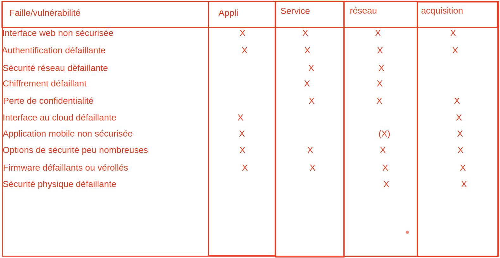
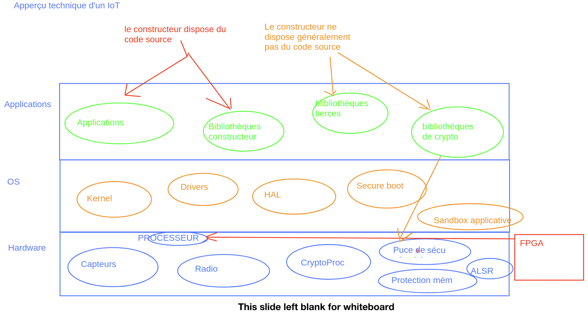
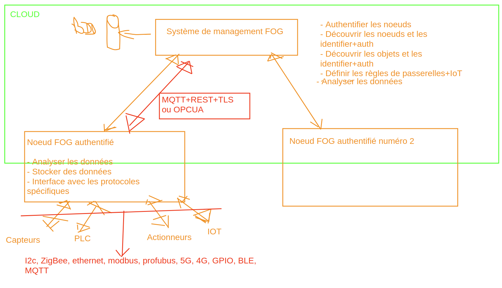

# IOT

On trouve de plus en plus d'bjet IOT qui remonte des infos dans le cloud (camera, badgeuse, capteurs, etc)

## Conception

4 couches : 

### 1 - acquisition : 
* Capteurs de toutes sortes => collecte des informations. 
* Peu de puissance de calcul (pas de grosses puces).
* __=>__ comment intégrer la sécurité à ce niveau ? 

### 2 - Réseau : 
* Permet de connecter lesobjets à l'internet. 
* Beaucoup de vulnérabilités (evesdropping : ecoute/interception), deni de service, usurpation des noeuds.
* A toute les  vuln d'un réseau classique sans les sécurités qui vont avec

### 3- Services : 
* Fournir l'essentiel des services aux applications embarquées dans l'objet ou a ses utilisateurs (pache / dns / ssh / biblio interne pour traiter les informations)

#### 4 - Application :
* Sert aux utilisateurs pour paramétrer l'objet, ou intéragir avec lui.

## Aperçu technique d'un IOT

* FPGA : puce sans rien, au constructeur de programmer la puce. Source de faille mais permet de patcher

Puces de sécurité : processeur crypto + puce de sécurité
Objectif : fournir les éléments de cryptographie nécessaire à la protection des firmwares et des communication, les algos de crypto sont implémentés physiquement dans les puces de sécurité et exécutés par un processeur dédié aux calculs crypto (décharge le microprocesseur central de ces traitements).

## Failles techniques/physiques

* Failles dues au materiel : beaucoup de type de failles possibles
* Blindage absent (sensibilité aux rayonnements électromagnetiques)
* JTAG/GPIO (debug)
* Interface "série" pour reset l'équipement
* Bouton reset usine
* Firmware : OS+logiciels présents sur une mémoire de stockage et chargés au démarrage => quel type de contrôle met-on en oeuvre pour 

## Les questions qu'il faudrait se poser avant d'acheter un IoT ?

* Le processus de MAJ du firmware est-il suffisement sécurisé ? 
    - Signature par certificat (autorité de confiance mondialement reconnu)
    - L'IoT vérifie bien ce certificat avant MAJ ?
    - Empreinte SHA-X du firmware, est-elle conforme à celle signalée par le constructeur
    PB : secret qui entoure ces procédures, le constructeur n'a pas envie dans la plupart des cas de le communiquer.
* Quelles sont les suites cryptographiques utilisées par l'IoT ?
* Accès physique à l'équipement est-il suffisant pour l'emploi que je vais en faire ?
* L'équipement est-il résistant aux attaques physiques ?
* Y a-t-il des protections contre le reverse engineering ? Comment sont stockées les clés de crypto ?

## Framework test objet IOT

https://cloudsecurityalliance.org/artifacts/iot-security-controls-framework

## Framework d'intergration

* FIWARE
* ThingsWork
* Oracle Java Embedded
* IoTivity
* Xively

__Device onboarding__ : Les éléments logiciels permettant à un IoT d'obtenir un accès aux réseau, de recevoir leurs paramètres réseau, de comprendre comment télécharger leur configuration de démarrage.

__Asset management__ : Ces composants d'un framework d'intégration permettent de monitorer chaque objet connecté, de le mettre à jour (son firmware, sa clé de chiffrement, d'obtenir un état de fonctionnement).

__Discovery__ : Leur rôle est d'authentifier et identifier des objets connectés, ET les serveurs avec lesquels ils communiquent.

__Sécurisation communication__ : Composants (issus du contrôleur) qui permettent de chiffrer les communications.

__cloud gateway__ : Composants permettant de communiquer avec des serveurs dans le cloud.

Système d'exploitation doivent être compatbile avec le framework d'intégration.

OS temps réel : RTOS (real time operating system)

TinyOS
VXWorks
SaphireOS
Contiki
FreeRTOS

Forces : 
- lighweight
- optimisé pour certains types de traitement

Faiblesses principales :
-    Sécurité pas toujours au goût du jour,
-    Difficultés d’adaptation en fonction des besoins (le code source n’est pas toujours disponible ET très souvent écrit en assembleur),

## Protocoles de communications

Deux grandes familles : 

* Objet utilisant des protocoles pouvant directement communiquer avec une plateforme cloud.
    - ex : Amazon Kinesis
* WSN (Wireless Sensor Network), protocoles de communication permettant aux IoT de communiquer entre eux, ou avec une gateway cloud, qui sont optimisés pour la vitesse et l'économie de données.
    - 802.11 Wifi
    - 802.15.4 contrôle authentification/chiffrement/intégrité (IoT)
    - 6loWPAN low power EAP
    - LoRaWAN (smartcities, smartgrid, industrie)
    - zigBee (une alternative à 802.15.4 pour les réseaux personneles) - protocol ouvert
    - zwave : protocol IoT pour particulier - propriétaire
    - Thread : évolution de 6loWPAN
    - Bluetooth : version dédiées - "pour le particulier"
    - BLE : Bluetooth Low Energy => très utilisé dans l'automatisation des particuliers : ne jamais utiliser, l'OWASP dit c'est le protocole le plus sensible de tous aux écoutes, hyper sensibles aux injections de paquets, la compromission des échanges de clés et enfantine -> outil Crackle  

## FOG

