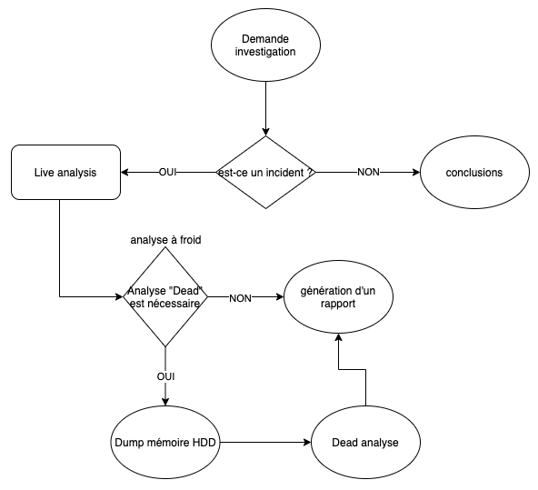

# Forensic

* Enquete scientifique
* La preuve de doit pas être altérée
* Préserver l'information

## Forensic physique

* ADN
* Empreintes digitales
* Sang
* etc

## Forensic numérique (informatique légale)

* Periphérique de stockage
* Traces réseaux
* Traces mémoire vive

La gendarmerie met un ordi sous cellé (toujours à deux), le cache, signature.

# Conservation de la preuve

* La preuve ne doit jamais être altérée, même de façon infime.

# Traçabilité

* Obligatoire de tracer qui a fait quoi, quand. __(chain of custody__)

# Phases de l'info légale

1) Conservation de la peuvre => aucun dommage / atltération effectué sur la preuve
2) Recherche de preuve(s)
3) Reconstruction des evenements
    - reconstruire les evenements sur un plan chronologique suite aux preuves trouvés =>  2)

# Attaque info (incident/réponse)

1) Valider s'il sagit d'un incident (recherches préliminaires).
    - un serveur qui perd des fichiers => peut-être un simple bug windows ou une attaque
2) Si c'est un incident
    - Préservation des données et traçabilité
    - Recherche de preuve
    - Remise en ordre des evênements
3) Rapport complet

# Erreurs à ne pas faire

* Redémarer la machine
* Allumer la machine
* Extraire le disque dur et le brancher en externe (antivirus va scan, windows monte en lecture/écriture), monter le disque en lecture/écriture
* Ne pas investiguer tout de suite ! On ne travail jamais sur la preuve, on la copie puis on taff dessus.

# Les bonnes pratiques

* Pour investiguer un disque dur il faut un HDD locker, c'est un chariot externe avec un système qui empêche l'écriture sur le disque (electroniquement)

