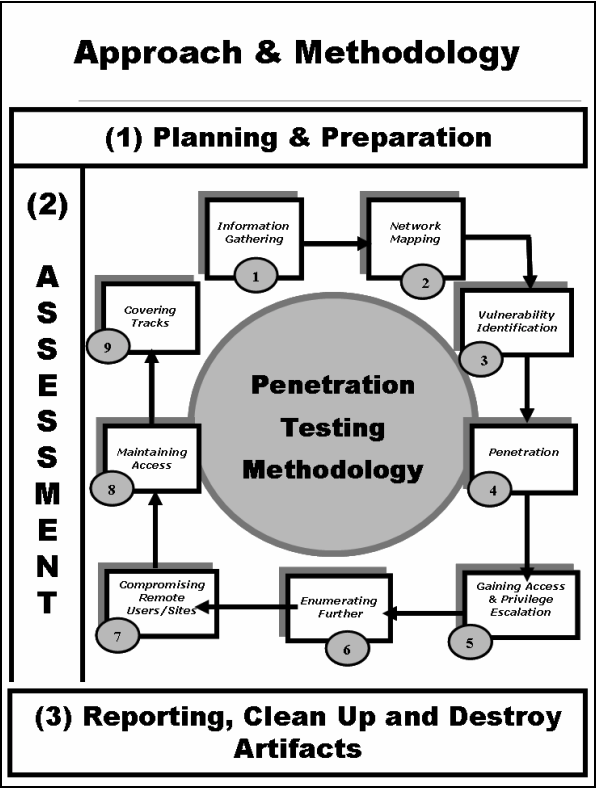

# Méthodologie de pentest

#### Quelques standard, framework de pentest
* OSSTM
* PTES
* OTG
* ISSAF => à savoir par coeur - Compatible Cyber Kill Chain (CKC)
    - https://untrustednetwork.net/files/issaf0.2.1.pdf
    - voir dans classroom

## ISSAF
__Divisé en 3 phases__



* Planning & preparation
* Assessment
* Reporting, Cleanup (prendre des notes !), (Destroy artifacts)


Je dois impérativement trouver les employées, se renseigner sur tous les emplyoés de l'entreprise. 
On va chercher : 
* nom / prenom / Telehpone/ fonction / place dans l'organigramme.


Side channel attack : Attaquer par un tiers au lieu de taper directement la cible.


- les investissements
- les solutions anti-spams (maybe CVE)
- les investisseurs (ceux qui ont la majorité des actions), si défonce l'investisseur (saint graal). 
- Que fait l'entreprise ? les services ?
- http ? ftp ? mails ? profile linkedin ?  

=> __shodan__


### Etape 2 - Network mapping
__On rentre dans la partie active__

* Tenter un fingerprint

    - Eviter de lancer nmap => grillé direct c'est connu boloss
    - Trouver les équipements de bordure, aux alentours
    - Identifier les réseaux les plus importants

### Etape 3 - Vulnerability assessment

On a trouvé du HTTPS, par empreinte c'est du vieux apache. On met un indice de ocnfiance devant (on a pas tenter la CVE on a aucune garantie que cela va fonctionner)

__/!\ Attention, NMAP peut renvoyer des faux positifs, il est bon de tenter de faire une autre empreinte avec un autre outil /!\ __

Il peut être cool de monter un lab similaire en local pour reproduire l'infra et avoir de meilleurs chances de réussir.


### Etape 4/5

__Exploitation, Gaining access and escalation__

On prend la main sur la machine puis on cherche à élever les droits.

Casser des mots de passe n'est jamais vraiment la bonne solution, chercher ce qu'aime l'admin, un pattern, etc.

seclist on github => Repo de wordliste à thème.
https://github.com/danielmiessler/SecLists

Les mots de passe par défaut, des routeurs/switch/etc qui ont un bouton RESET.

### Etape 6 - Enumerating further

```
hashdump
```

Recuper les hash de tous les mots de passes, on fait du mandling en tache de fond en esperant trouver quelque chose.

Si python installé, on peut snifer le réseau etc

Regarder dans les cookies => passwords / token


### Etape 9 - Covering tracks

Effacer toutes les traces de notre passage. Bien prendre des notes de ce qu'on fait (malware, backdoor, etc).
Eviter les forensics de nous retrouver !


## Préparation à un audit

Tout d'abord il faut rencontrer le client pour voir queqlues points : 

* Temps à consacrer

* Cible à pentest

* Le contenu à auditer (ce qu'il ne faut pas toucher)

* Contact d'urgence (si on tombe la prod il faut tout de suite prévenir) / et vice-versa si le pentest ralentit trop la prod

* Définir une date de début

* La méthode utilisée doit être communiqué au client, la méthodologie (ISSAF/OTG/etc)

* Bien définir dans le contrat ce qui peut-être fait ou non (crocheter les serrures secu physique ? / ingéniérie sociale ?)

* Audit de nuit (place parking, guardien, etc)

### Avocat

* Il est fortement conseillé de faire appel à un avocat pour un contrat type afin de s'assurer de l'aspect légal.

### Communiquer

* Avoir un contact au seins de l'enterprise pour le garder informer des nouveautés.

### Conseiller

* Pour chaque faille trouvé, il faut conseiller sur "comment s'en protéger ?" au client, les bonnes pratiques de sécurités.

* Tout énumérer ce qu'on fait, presque faire un tuto de comment on a fait.

### Netoyer

* Enfin, nétoyer (sauf si le client dit non), remettre tout comme avant. (ex :snapshot).

