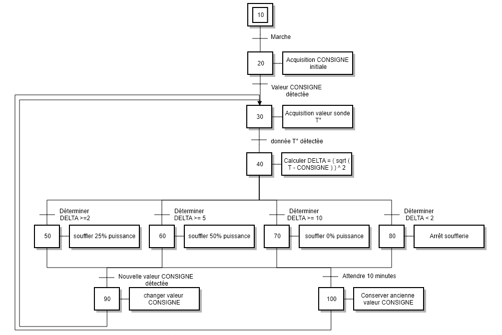

* Si delta >= 2° => 25% puissance

* Si delta >= 5° => 50% puissance

* Si delta >= 10 => 100% puissance

* Points de mesure t° effective : 10 minutes

Un imeuble avec en 4 etages. Chaque étage à sa sonde de température.

__macro pour un étage__

