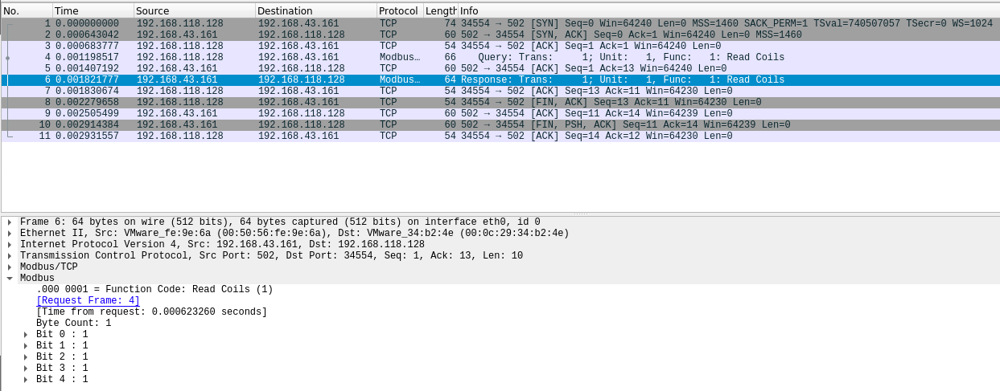
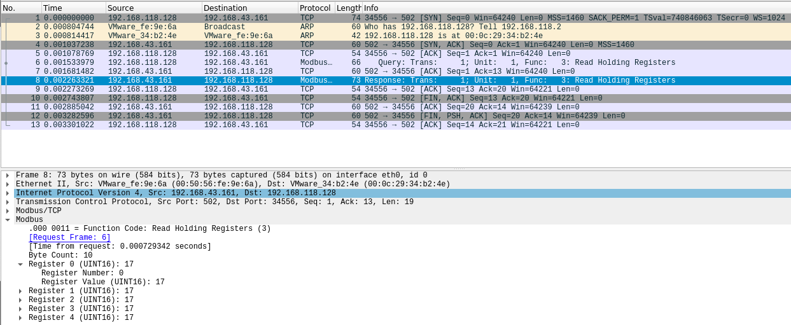
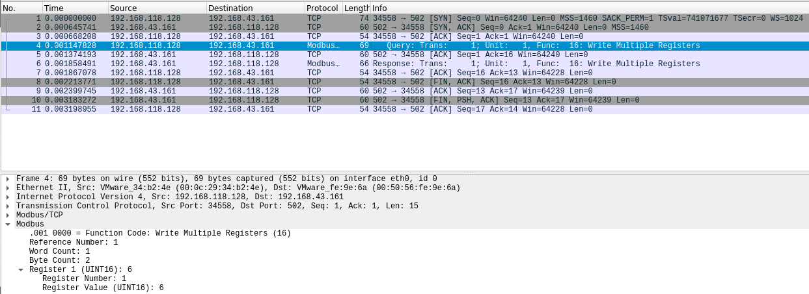
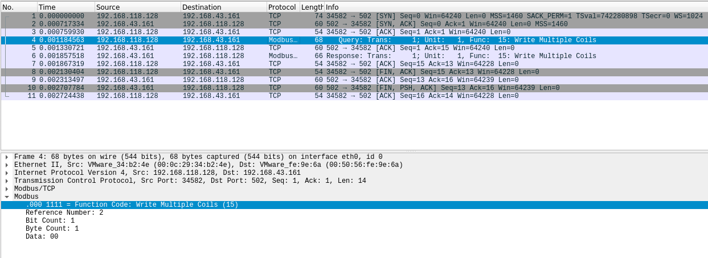
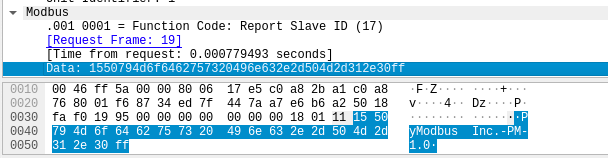
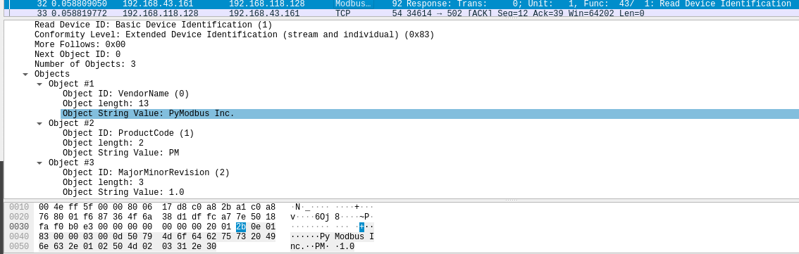
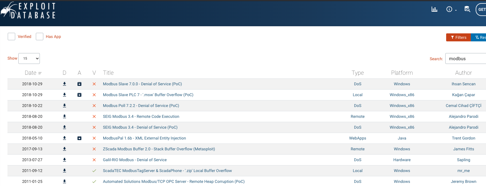

# Exercices modbus
##### Julien Faou  

## Installation modbus

```
sudo pip3 install pyModbus
```

## Exercice 1 - Compromission avec modbus-cli

```
sudo modbus read -h
Usage:
    modbus read [OPTIONS] HOST ADDRESS COUNT

Parameters:
    HOST                             IP address or hostname for the Modbus device
    ADDRESS                          Start address (eg %M100, %MW100, 101, 400101)
    COUNT                            number of data to read

Options:
    -w, --word                       use unsigned 16 bit integers
    -i, --int                        use signed 16 bit integers
    -d, --dword                      use unsigned 32 bit integers
    -f, --float                      use signed 32 bit floating point values
    --modicon                        use Modicon addressing (eg. coil: 101, word: 400001)
    --schneider                      use Schneider addressing (eg. coil: %M100, word: %MW0, float: %MF0, dword: %MD0)
    -s, --slave ID                   use slave id ID (default: 1)
    -p, --port PORT                  use TCP port (default: 502)
    -o, --output FILE                write results to file FILE
    -D, --debug                      show debug messages
    -T, --timeout TIMEOUT            Specify the timeout in seconds when talking to the slave
    -C, --connect-timeout TIMEOUT    Specify the timeout in seconds when connecting to TCP socket
    -h, --help                       print help
```

__A l’aide de la commande modbus read, lisez les 5 premiers registres de type bit__

```
sudo modbus 192.168.43.161 1 5
```
```
1          1
2          1
3          1
4          1
5          1
```



__A l’aide de la commande modbus read, isez les 5 premiers registres entiers__

```
sudo modbus read 192.168.43.161 400001 5
```
```
400001         17
400002         17
400003         17
400004         17
400005         17
```



__A l’aide de write, modifier un entier parmi les 5 premiers entiers__

```
sudo modbus write -h
```

```
Usage:
    modbus write [OPTIONS] HOST ADDRESS VALUES ...

Parameters:
    HOST                             IP address or hostname for the Modbus device
    ADDRESS                          Start address (eg %M100, %MW100, 101, 400101)
    VALUES ...                       values to write, nonzero counts as true for discrete values

Options:
    -w, --word                       use unsigned 16 bit integers
    -i, --int                        use signed 16 bit integers
    -d, --dword                      use unsigned 32 bit integers
    -f, --float                      use signed 32 bit floating point values
    --modicon                        use Modicon addressing (eg. coil: 101, word: 400001)
    --schneider                      use Schneider addressing (eg. coil: %M100, word: %MW0, float: %MF0, dword: %MD0)
    -s, --slave ID                   use slave id ID (default: 1)
    -p, --port PORT                  use TCP port (default: 502)
    -D, --debug                      show debug messages
    -T, --timeout TIMEOUT            Specify the timeout in seconds when talking to the slave
    -C, --connect-timeout TIMEOUT    Specify the timeout in seconds when connecting to TCP socket
    -h, --help                       print help
```

```
sudo modbus write -i 192.168.43.161 400002 6
```



```
sudo modbus read -i 192.168.43.161 400002 1
```

```
400002          6
```

__A l’aide de write, modifier un booléen parmi les 5 premiers booléens modifiables__

```
sudo modbus write 192.168.43.161 3 0
```



```
sudo modbus read 192.168.43.161 3 1
```

```
3          0
```

## Exercice 2 - Scan avec Nmap

__Executer un nmap avec un script nse dédié à l’énumération pour modbus__

```
nmap --script-help "*modbus*"
```

```
Starting Nmap 7.80 ( https://nmap.org ) at 2020-09-01 14:24 CEST

modbus-discover
Categories: discovery intrusive
https://nmap.org/nsedoc/scripts/modbus-discover.html
  Enumerates SCADA Modbus slave ids (sids) and collects their device information.

  Modbus is one of the popular SCADA protocols. This script does Modbus device
  information disclosure. It tries to find legal sids (slave ids) of Modbus
  devices and to get additional information about the vendor and firmware. This
  script is improvement of modscan python utility written by Mark Bristow.

  Information about MODBUS protocol and security issues:
  * MODBUS application protocol specification:  http://www.modbus.org/docs/Modbus_Application_Protocol_V1_1b.pdf
  * Defcon 16 Modscan presentation: https://www.defcon.org/images/defcon-16/dc16-presentations/defcon-16-bristow.pdf
  * Modscan utility is hosted at google code: http://code.google.com/p/modscan/
```

```
nmap -p502 --script modbus-discover.nse 192.168.43.161
```

```
Starting Nmap 7.80 ( https://nmap.org ) at 2020-09-02 09:21 CEST
Nmap scan report for 192.168.43.161
Host is up (0.0018s latency).

PORT    STATE SERVICE
502/tcp open  modbus
| modbus-discover: 
|   sid 0x1: 
|     Slave ID data: PyModbus Inc.-PM-1.0\xFF
|_    Device identification: PyModbus Inc. PM 1.0

Nmap done: 1 IP address (1 host up) scanned in 0.30 seconds
```





## Exercice 3 - Recherche d'exploit

__Trouver au moins un exploit existant dans exploit-db.com concernant un serveur modbus__



## Exercice 4 - Avec Scapy

```
ip=IP(src='192.168.118.128',dst='192.168.43.161')
tcp=TCP(sport=6666,dport=502,flags='S')
pkt=ip/tcp                                 
pkt.show()      

###[ IP ]### 
  version= 4
  ihl= None
  tos= 0x0
  len= None
  id= 1
  flags= 
  frag= 0
  ttl= 64
  proto= tcp
  chksum= None
  src= 192.189.118.128
  dst= 192.168.43.161
  \options\
###[ TCP ]### 
     sport= 6666
     dport= 502
     seq= 0
     ack= 0
     dataofs= None
     reserved= 0
     flags= S
     window= 8192
     chksum= None
     urgptr= 0
     options= []

send(pkt)
```

```
answ=sr1(pkt)
```

```
answ=sr1(pkt)                     
Begin emission:
.Finished sending 1 packets.
*
Received 2 packets, got 1 answers, remaining 0 packets
```

```
answ.show()
```

```
###[ IP ]### 
  version= 4
  ihl= 5
  tos= 0x0
  len= 44
  id= 65409
  flags= 
  frag= 0
  ttl= 128
  proto= tcp
  chksum= 0x17d8
  src= 192.168.43.161
  dst= 192.168.118.128
  \options\
###[ TCP ]### 
     sport= 502
     dport= 6666
     seq= 1364939808
     ack= 1
     dataofs= 6
     reserved= 0
     flags= SA
     window= 64240
     chksum= 0xb836
     urgptr= 0
     options= [('MSS', 1460)]
###[ Padding ]### 
        load= '\x00\x00'
```


__Rechercher un framework (lmot clé smod?) pour scapy permettant de crafter des requetes vers des serveurs modbus__

* Dans le script "asyncmodbus.py" utilisé pour créer le serveur, la library __pymodbus__ est utilisé.
Voici la documentation : https://pymodbus.readthedocs.io/en/latest/index.html

### Read and write boolean

```
from pymodbus.client.sync import ModbusTcpClient

client = ModbusTcpClient('192.168.43.161')
client.write_coil(1, False)
result = client.read_coils(1,1)
print(result.bits[0])
client.close()
```

```
False
```

```
from pymodbus.client.sync import ModbusTcpClient

client = ModbusTcpClient('192.168.43.161')
client.write_coil(1, True)
result = client.read_coils(1,1)
print(result.bits[0])
client.close()
```

```
True
```


