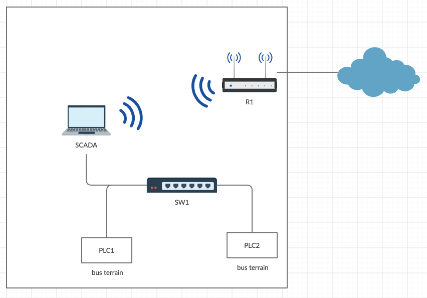
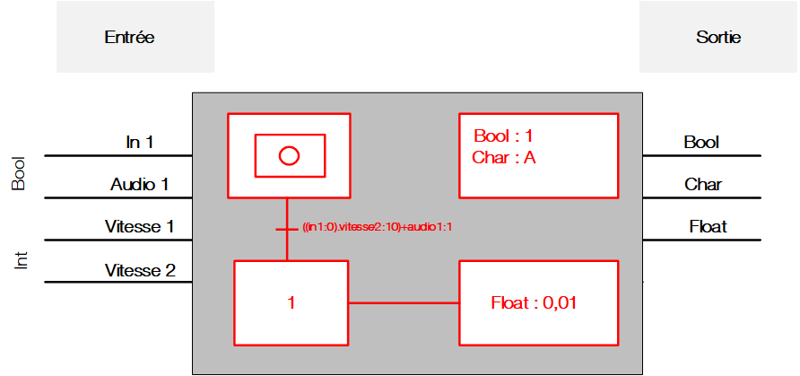
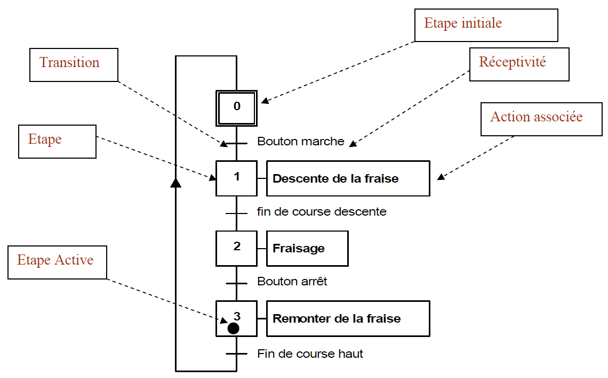
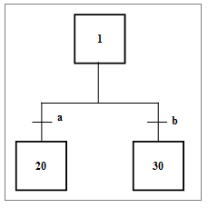
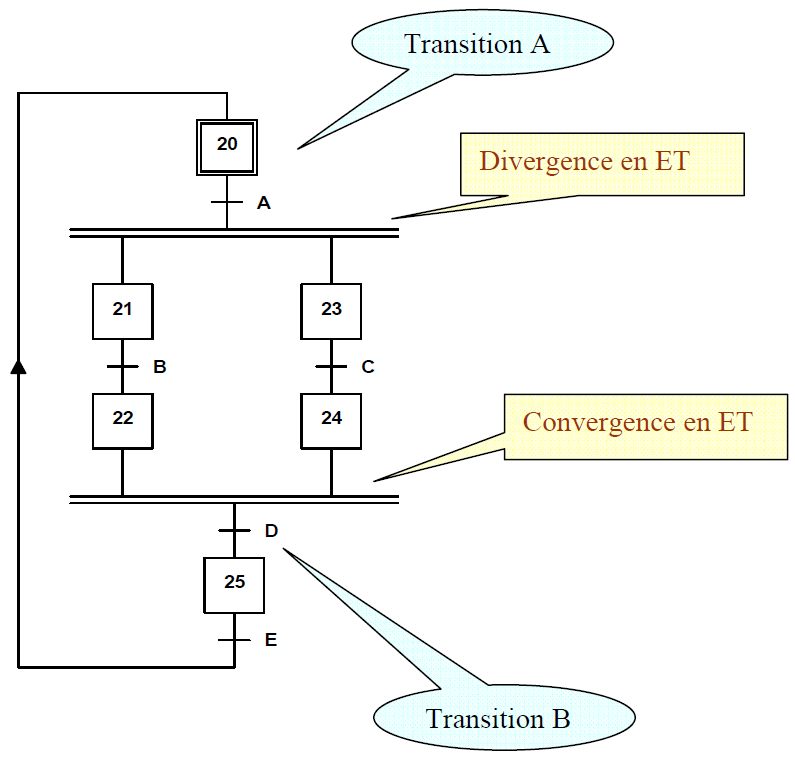

# Graphset

## exemple

__Transition__ : on passe d'une étape à la suivante en franchissant une transition. Une transition est présente quand c'est une nécessité.

__Etape__ : Toujours un verbe à l'infinitif

### OU

### ET

