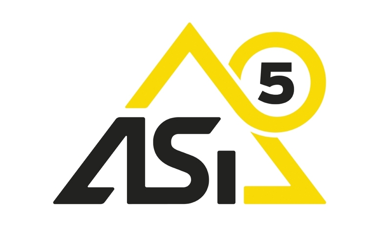

# Réseaux industriels

## Presentation

Voici une usine à Thé, tous les composants sont contrôlés par un controleur 


* Le PLC (boitier de commande), gère les capteurs (actionneurs) et les moteurs.

* Par la suite on a connecté c'est boitier de commande à un poste de supervision (SCADA) pour gérer plusieurs systèmes industriels à distances.

* Un système de contrôle SCADA permet de recevoir des données depuis les boitier de commande, mais aussi les contrôler ! En piratant le PC de supervision, on peut contrôler l'ensemble des réseaux industriels.

* Tous ces composants ont des firmware, très peu mis à jour. => __STUXNET__

## Les Bus

__Machine outil (pilotage)(machine autonome)__

* Bus capteur : ASI, Seriplex
* Bus actionneur : interbus
* Bus de terrain (device bus): Modbus, interbus-S, profibus, device net

        

__Machine__ (pilotage et/ou process) => machine discute avec PLC ou SCADA

* Bus fieldbus (bus locaux), Flipway, profibus, FMS

__pilotage des processus__ (SCADA)

* Ethernet, MMS


__Bus entre cartes electroniques et une machine__

* Bus I2C : interconnection des cartes electroniques entre elles, ou entre composants sur une même carte électronique.

* Bus CAN : relier 2 cartes electronique entre elles (< 1km)

* Bus D2B : < 100m très utile (enciennement) en domotique.

## Contraintes industrielles

* Determinisme : c'est quand le comportement (notion de temps) des sorties est totalement prévisible en fonction des valeurs des entrées.

Dans les usines il est important de réaction des équipements.
```
Ex : Le bouton d'arrêt d'urgence ne peut être gérer par ethernet (best effort), il faut que quand le bouton soit présser, tout s'arrête le plus rapidement possible et de façon systématique !
```

* Prévisibilité : On sait de source sûr comment mon système se comporte en fonction des entrées/sorties.

* Urgence : priorise le traitement des urgences en fonction de leur gravités.

* Contraintes environnementales : corrosivité, explosivité, etc

* Token ring : Chacun a la parole pendant un temps, si un tombe en panne tout se casse la gueulle. Débit faible.


## Presentation des Bus
### Modbus

* Créé en 1979, bus et protocole de communication sur le modèle maître/esclave.
    - RS232 (1 maître (actif ou passif), 115 kb/s, 15 mètres)
    - RS422 (plus utilisé)
    - RS485 (rétrocompatible RS232)

* Basé sur un modèle requête / réponse
* structuré en PDU (Protocol Data Unit) identique en serie ou ethernet. et en ADU (Application Data Unit)


__Adresse escalve null => Broadcast__


__MBAP__ : 
- Transaction ID : (2 octets, encodé en ASCII), défini par le client (esclave), réutilisé par le serveur pour parler au client.
- Protocol ID : (2 octets), toujours à 0000.
- Length : (2 octets), longueur du message qui va suivre (octets)
- Unit ID : (2 octets), numéro (adresse) de l'esclave


