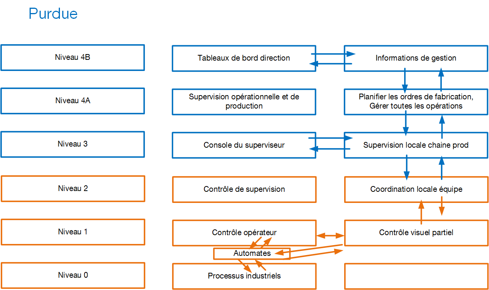
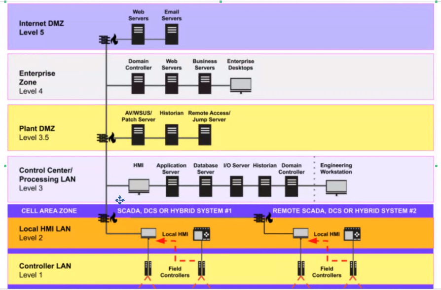
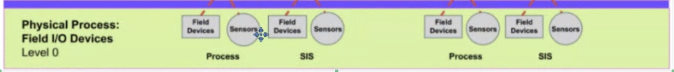

# Securité des réseaux industriels

## ICPE - installations classés pour la protection de l'environnement

__"usines, ateliers, dépôts, chantiers, installations exploitées ou détenues par toute personne physique ou morale, publique ou privée, pouvant présenter des dangers ou des inconvénients pour le voisinage, pour la santé, la sécurité, la salubrité, l'agriculture, la nature, la conservation des sites et monuments et les éléments du patrimoine archéologique".__

## Installation industrielle 

__Système technologique délimité par un périmètre (ex : un site) qui peut être__

* Un site fixe (un lieu de stockage, un lieu d'approvisionnement, une usine, une raffinerie, un réseau de transports, un port maritime...)
* Un site mobile (pétrolier, croiseur, plateforme pétrolière, satellite...)__

__La configuration du site peut-être de deux formes :__

* Monolithique : un endroit unique (site) ou tout est centralisé.
* Réseau hybride : champ éolien, smartgrid (genre linky)

## Travaux du passé sur la sécurité des réseaux infustriels et installations industrielles

### Modèle purdue : 

* __Début de l'ère industrielle -> concentration des efforts d'ingéniérie sur des méthodes permettant d'optimiser les processus de fabrication (redondance équipements -> pb de porte-monnaie, ne pas perdre d'argent à cause d'une prod défaillante -> resillience industrielle). Optimisation des méthodes de stockage des matières premières ou produits finis (flux tendu)__

* __Début 1900 => premières normes environnementales : premier crash pétrolier =>  nécésité de réfléchir à modifier l'approche purement optimisation économique dans la conception des usines (installation industrielles) -> arrivée de l'informatique__

Début des travaux : 1970, première version livrée et exploiter : 1980
Américains, qui créé le modéle Purdue :
Entreprise americains, "Purdue Laboratory for Applied Industrial Control". Organisation dont le but été de créer une "organisation" des installations industrielles compatibles avec les critères dits "CIM" (Computer Integrated Manufacturing)

Ce modèle a évolué et est devenu le modèle CIM89 (revalidé/modifié en 1989).
Tout le monde le nomme CIM89 ou CIM, le modèle Purdue.
Tous les industriels du monde entier connaissent ce modèle.

* Ce modèle catalogue les activités, les tâches et processus à operer et hiérarchise le contrôle entre les niveaux.

__ICPE__ : Nomenclature
__SEVESO__ : Classification

Ces deux éléments sont issus de la règlementation française.

## Nomenclature ICPE : Rubriques permettant de classer la nature du risque

* Substances (toxiques, comburants, explosivité, combustible, corrosion, réactions/précipitations chimiques)
* activités (agriculture, élevage, agroalimentaire, textie, papier, carton, minerais, chimie, plastique, déchets)
* émissions industrielles : en fonction des rejets, nécessité de recourir aux meilleures techniques existantes afin de prévenir toute pollution environnementale.

L'entreprise remplit un formulaire ICPE lorsqu'elle a une activité industrielle, ce formulaire est transmis au préfet.
Le préfet transmet à l'état ce formulaire avec avis.
L'état qui donne l'autorisation d'exploiter, si les méthodes de dépollution permettent d'atteindre les VLE (Valeurs Limites d'émission)

* Plusieurs sites de prod = __plusieurs formulaires ICPE.__

## SEVESCO
### Niveau de classement

* __NC__ (Non Classé) : Le activités sont sous le seuil de pollution ou de dangerosité de la nomenclature ICPE.
* __D__ (Déclaration) : L'installation ICPE, doit faire l'objet d'une déclaration au préfet avant la mise en service du site de production (Le risque est acceptable si l'entreprise suit les prescriptions nationales).
* __DC__ (Déclaration Contrôlée) : Déclaratif au préfet + un contrôle et un audit régulier par un organisme externe.
* __E__ (Enregistrement) : Avant la mise en service, l'entreprise a monté un dossier SEVESO, ce statut indique que le dossier est en cours de traitement par les services de l'état. Le préfet demande un audit extérieur pour vérifier que le dossier est dans les clous des préconisations nationales
* __A__ (Autorisation) : D/DC. Le préfet a statué par arrêté préfectoral au cas par cas de l'autorisation SEVESO (pour les sites non-classés)
* __AS__ (Autorisation avec Servitude) : risques technologiques élevés  dépassant les seuils maximums de dangerosité et/ou de rejets autorisés par l'état. Les seuils dépassés sont autorisés parce que le site de production est considéré comme d'utilité publique. Dans ce cas il sera impossible d'installer d'autres sites industriels ou habitations personnelles à proximité. 

__Entre 1993 et 2014, les états européens ont mis en oeuvre les lois de programmation militaire ENISA (2014-2019 France).__

* __Loi__ : Précise la responsabilité des états de définir et d'assurer une cybersécurité suffisante des systèmes critiques des opérateurs d'importance vitale (OIV). Par extension, la responsabilité de définir les bonnes pratiques pour toute entreprise opérant avec des systèmes d'information.

* __SAIV__ : Secteurs d'activités d'importance vitale (article R1332-2 loi programmation)
* __PIV__ : Point d'importance vitale (Site), font l'objet d'audits constants concernant la sécurité physique et la mise en oeuvre de contre-mesures à chaque risque potentiel evalué.
* __OIV__ : Opérateur d'importance vitale (Entreprise) R1331-1 loi militaire : Organisation qui exerce des activités comprises dans un secteur d'importance. Gère des établissements ou des ouvrages dont le dommage ou l'indisponnibilité (ou la destruction) à la suite de malveillance, de sabotage, de terrorrisme pourrait directement ou indirectement altérer gravement le potentiel de guerre, économique, la sécurité ou la survie du pays, ou encore mettre gravement en danger la santé de la population. Les ministres vont fixer les OIV pour chaque ministère qu'ils gèrent.

__C'est en France, le premier ministre qui décide des SAIV__

## ANSSI
__ANSSI a fait un effort de classification, qui sont des modèles complémentaires à SEVESO, OIV, PIV et qui permmettent de gérer/plannifier la sécurité d'une entreprise critique ou d'un secteur critique :__

* __Type A1__ : Chaîne de procédé (atelier automatisé -> purdue niveau 0 et 1). 1 seul site qui crée son produit final de bout en bout. l'accès aux systèmes numériques de prod (supervision, commande, maintenance) implique un raccordement à des réseaux extérieurs, ou un accès physique -> Attention : Contrôle d'accès physique (tracabilité), si des tiers interviennent, un contrôle spécifique. Recommande des IDS pour les connexions réseaux. Mise à jour des firmwares systématique, obligation de contrôler l'absence de malware.

* __Type A2__: Site de maintenance d'équipements (purdue 0,1,2) : zone(s) de stockage de pièces détachées + une partie des sites A1, mises à jour de firmware, adaptation de certains équipements en fonction des conditions. Recommendations : Accès physique / tracabilité des tiers, IDS, contrôle de la validité des firmwares + contrôle del'absence de malwares

* __Super A__: Installation industrielle distribuée à logistique semi-automatisée (purdue 0 à 4) production répartie sur plusieurs sites (plus ou moins distants), la logistique entre site est semi-automatisée. Contiennent des sites A1, des zones de stockage (produits intermédiaires), les sites A2. Recommendations : Très forte nécessité de chiffrer tout le traffic entre les sites. Tracabilité des mouvements de produits entre sites, IDS, contrôle + MàJ des firmwares y compris de tous les IoT de la chaîne de transport. Communication IoT + du reste des sites de prod est intégralement chiffré .séparation des communications (VLANs, pas de communication autorisées entre sites, sauf pour les besoins de la chaîne de prod et de la chaîne IoT).

* __B1__ : Bâtiment fixe. Bâtiment nécessitant un approvisionnement en eau , énergie, disposant d'une évacuation de déchets, autonimie maximale recherchée (datacenter, défense nationale -> OIV). Recommendations : Sécurité physique paranoïaque, surtout sur la partie industrielle. Exemple : building avec des salariés. Ventilation/clim/eau potable/ascenseurs -> garantir le bon fonctionnement, la résilience de ces systèmes.

* __B2__ : Bâtiments mobiles se déplaçant ou pouvant se déplacer et dont le déplacement est nécessaire à leur mission. La notion de sécurité des personnes est accrue -> Sous marin, le plus important sera d'évacuer les occupants en cas de cyberattaque paralysant les systèmes du sous-marin. Le bâtiment mobie doit disposer en tous temps et toute circonstance de moyens lui permettant de communiquer.

* __B3__ : Bâtiment mobile réparti. Comme un B1, mais son périmètre est plus étendu qu'un bâtiment, par exemple toute l'automatisation d'une ville (signalisation, caméras, éclairage public, smartgrid, routes à accès contrôlé -plots-, relais télécommandés, centres de contrôle etc...). Recommendations : Hardening fort sur les communications sans fil ou à distance. hardening des accès physique aux relais de télécommunication.

* __Super B__ : installation massivement répartie à échelle d'un pays ou un continent (par ex trafic aérien). Recommendations : hardening des communications, contrôle paranoïaque de la sécurité.

* __C1__ : Equipements sans prépondérance logicielle mais à rique numérique -> fourniture de services à la population, exposé à un risque(s) numérique(s), ex : centrale nucléaire. -> sensibilisation aux risques informatiques y compris les accès physiques, entrainements réguliers (mise en situation des salariéss, équipe informatique : SOC/NOC/CSIRT), Nouveau : Mise en place de système de détection comportementale.

* __C2__ : Réseaux de distribution, achemine des fluides d'un point A à un point B. risques sur la chaîne de transport. Attention : la sécurité est du ressort de l'ANSSI qui ne communique pas sur le sujet.

